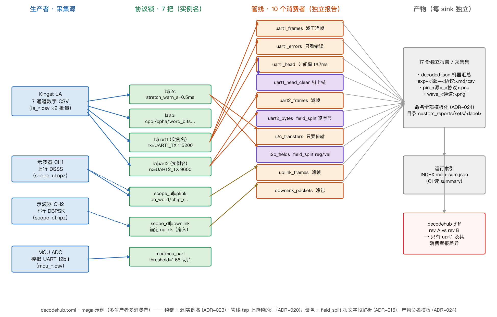

# 复杂项目示例：多生产者 / 多消费者

一个"越复杂越好"的 decodehub.toml 展示，**已实测跑通**（本仓库 CI 回归覆盖
管线/锁命名语义；本目录的采集文件由脚本合成，不入库）。



（上图由 draw_pipeline.py 生成：4 生产者 → 7 协议锁 → 10 消费者管线 → 独立产物；紫色 = field_split 报文字段解析，虚线 = 下行锚定上行）

## 场景

- **4 个生产者**：Kingst LA（7 通道：SPI + I2C + 两路 UART）、示波器 CH1
  （上行 DSSS）、示波器 CH2（下行 DBPSK，锚定 CH1）、MCU ADC（模拟 UART，
  12bit 码值）。
- **7 把协议锁**：同源同协议多路并存（`uart1`/`uart2` 实例名区分，ADR-023）、
  跨协议锚定（`downlink` 的 `uplink_source` 扇入）、模拟源切片参数
  （`threshold`/`hysteresis`）、协议形状参数全量可配（`pn_word`/`fc_nominal`…）。
- **10 个消费者（管线）**：同一生产者喂多个独立 sink——帧提取、错误隔离、
  时间窗切片、链上链（管线再被管线消费）、**报文字段解析**（`field_split`
  按内联规格把 I2C 传输载荷切成 reg/val 字段树，ADR-016）；
  每条管线独立报告/导出/渲染。
- **产物命名与路径全模板化（ADR-024）**：`custom_reports/explore/sets/<采集集>/`
  布局 + `exp-{source}-{protocol}.{ext}` 等全部文件名模板，占位符严格校验。
- **2 个运行**：`explore`（内联解码定义，全配置单文件）+ `repeat`
  （引用 `profiles/repeat-mcu.json` 档案，日常重复调试形态）。
- **批量**：`la_*.csv` 两份（固件 rev A/B）+ 单文件广播 → 逐采集集解码，
  `decodehub diff` 直接定位两版固件的差异帧。

## 跑起来

```bash
python make_captures.py          # 合成 captures/（约 30s，含 DSSS/DBPSK 合成）
decodehub validate               # 校验配置/档案/采集绑定
decodehub run --run explore      # 4 源 7 锁 8 管线 × 2 采集集
decodehub run --run repeat       # 档案引用形态，MCU UART 批量
# 固件版本对比（多消费者下的回归定位）：
decodehub diff reports/explore/001_la_rev_a/decoded.json \
               reports/explore/002_la_rev_b/decoded.json
```

实测结果（供对照）：explore 每采集集 190 事件、17 份独立报告
（7 把锁 + 10 条管线）；uart1 解出 `Hello LA rev A/B`；I2C 字段解析
`reg=0x00 val=0x2A`；diff 仅 `uart1` 及其消费者报差异（rev A/B 只差这一路），
时间窗管线 `uart1_head` 一致。

## 语法要点

- **多行参数用子表形式**（TOML 行内表不能跨行）：`[[locks]]` 的标量键写完后
  跟 `[runs.X.decode.locks.params]`，附着最近一个数组元素。
- **`locks` 的表形式与数组形式不可在同一文件混用**（TOML 键类型限制）；
  需要同源多把锁时整体用数组形式。
- 未知参数/未知字段一律报错并列出可配项——`decodehub params <协议>` 查看
  每个协议的全部可配参数。
